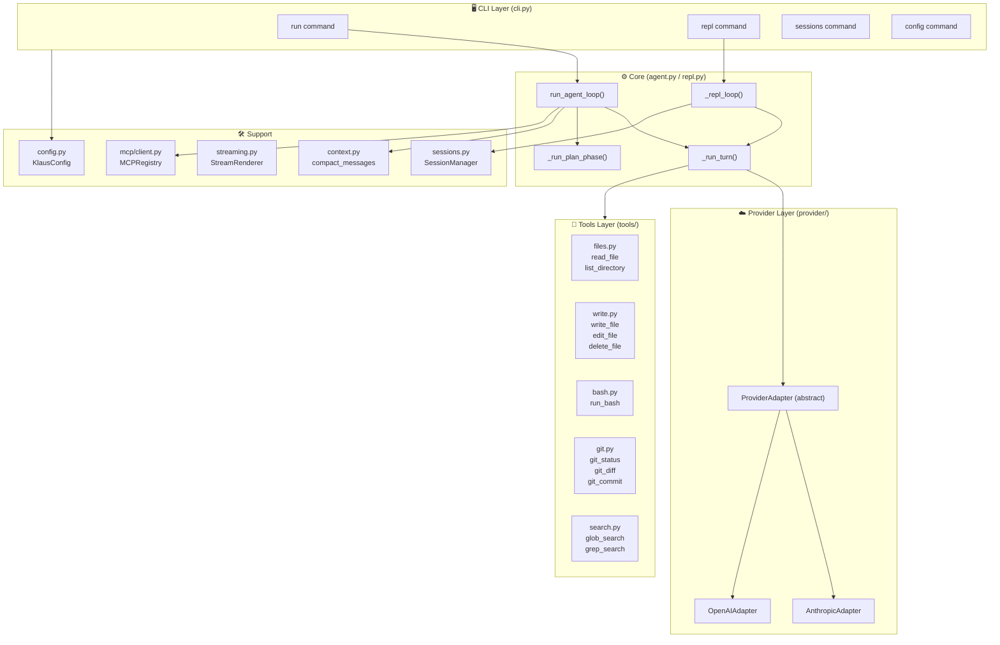
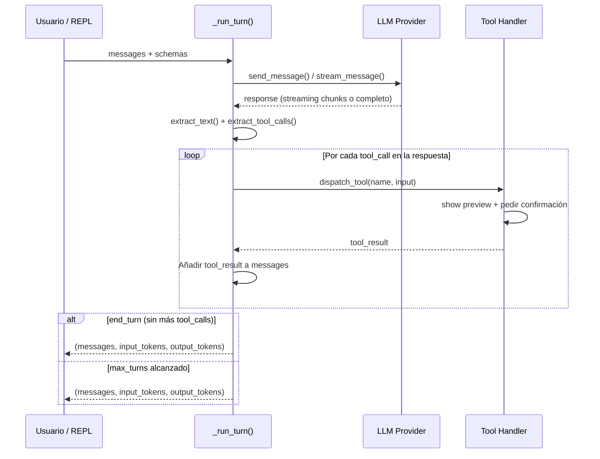

# 🏗️ Arquitectura

## 🤔 ¿Qué hago? ¿Cómo lo hago? ¿Y para qué lo hago?

**¿Qué hago?** Describir la arquitectura interna de Klaus Code CLI — módulos, flujo de datos y decisiones de diseño clave.

**¿Cómo lo hago?** Con diagramas Mermaid del flujo del agente, la pila de módulos y el ciclo request→response→tool→response.

**¿Para qué lo hago?** Para que cualquier contribuidor pueda entender el sistema en 10 minutos y extenderlo sin romper el contrato entre módulos.

---

## 🗺️ Vista de alto nivel



---

## 🔄 Ciclo de un turno del agente



---

## 📦 Descripción de módulos

### `cli.py` — Punto de entrada

Typer app con tres sub-apps: `config_app`, `sessions_app` y el root `app`.

Comandos expuestos:
- `run` — ejecuta el agente una vez y sale
- `repl` — abre el REPL interactivo
- `init` — genera config inicial (con `--scan` genera CLAUS.md)
- `config show` — muestra configuración activa
- `sessions list/show/clear` — gestión de sesiones

### `agent.py` — Loop del agente

- `run_agent_loop(prompt, ...)` — entry point público para el modo `run`
- `_agent_loop(messages, ...)` — loop interno multi-turn que acumula mensajes y despacha tools
- `_run_plan_phase(...)` — modo plan: primer turno con prompt system que deshabilita tools, genera plan, pide confirmación humana y luego ejecuta

### `repl.py` — REPL interactivo

- `run_repl(...)` — configura la sesión y arranca el loop
- `_repl_loop(...)` — loop de input → `_run_turn` → output con soporte de comandos especiales (`/clear`, `/help`, `/tokens`, etc.)
- `_run_turn(messages, ...)` — **compartido con agent.py** — llama al LLM, acumula tool calls y devuelve `(messages, input_tokens, output_tokens)`

### `config.py` — Configuración

Pydantic BaseModels con validación estricta. `load_config()` lee `~/.Klaus/config.yaml`, hace merge con los valores por defecto y acepta overrides de CLI.

### `provider/` — Adapters de proveedor

`ProviderAdapter` define el contrato:
```python
async def send_message(messages, tools, **kwargs) -> dict
async def stream_message(messages, tools, **kwargs) -> AsyncIterator[str]
async def close() -> None
```

`AnthropicAdapter` y `OpenAIAdapter` implementan este contrato para sus respectivas APIs.

### `tools/` — Herramientas

`TOOL_SCHEMAS` — lista de JSON Schema descriptors en formato Anthropic tool_use.
`TOOL_HANDLERS` — dict `name → async callable`.
`configure_confirmations(auto_approve_writes, auto_approve_bash)` — wires los flags de modo YOLO.

### `sessions.py` — Persistencia

`SessionManager` — CRUD de sesiones en `~/.Klaus/sessions/` (JSON).
`SessionLock` — file lock para prevenir escrituras concurrentes si hay múltiples instancias.

### `streaming.py` — Rendering

`StreamRenderer` — usa `rich.live.Live` para mostrar tokens en tiempo real según llegan del provider. Stop para capturar el texto completo al final del turno.

### `context.py` — Gestión de contexto

`load_project_context(project_root)` — carga CLAUS.md del proyecto y ancestors.
`compact_messages(messages, ...)` — reduce el historial eliminando mensajes intermedios cuando el contexto supera el 80% del límite.
`KlausIgnore` — parser de `.klausignore` (formato `.gitignore`) usado por las tools de búsqueda.

### `mcp/client.py` — Cliente MCP

`MCPRegistry` — gestiona el ciclo de vida de servidores MCP externos (startup, tool registration, dispatch, shutdown).

---

## 🔗 Documentación relacionada

- [🔧 Tools](tools.md) — descripción de cada tool desde la perspectiva del usuario
- [🔌 MCP](mcp.md) — configuración de servidores MCP externos
- [⚙️ Configuration](configuration.md) — todas las opciones de KlausConfig
