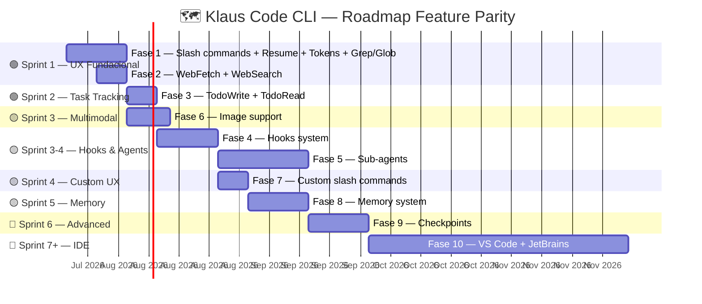
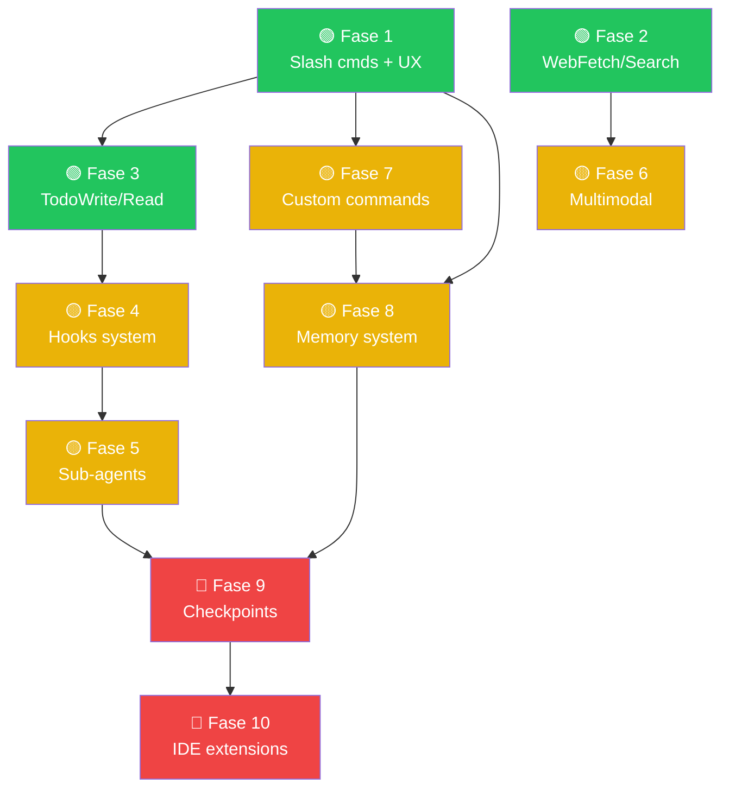

# 🗺️ Roadmap — Feature Parity con Claude Code

## 🤔 ¿Qué hago? ¿Cómo lo hago? ¿Y para qué lo hago?

**¿Qué hago?** Analizo la brecha de funcionalidades entre Klaus Code CLI y Claude Code (el CLI oficial de Anthropic), y propongo un roadmap priorizado para alcanzar la paridad o superarla.

**¿Cómo lo hago?** Mediante un análisis exhaustivo feature por feature, valorando cada funcionalidad según su impacto en la experiencia del usuario (valor) y el coste estimado de implementación (esfuerzo). Las funcionalidades se agrupan en fases iterativas con dependencias explícitas.

**¿Para qué lo hago?** Klaus Code CLI no es una copia de Claude Code — es un CLI diseñado para conectarse a **klaude-proxy** y soportar modelos locales (Ollama, qwen3, deepseek-r1) además de Anthropic. El objetivo de la paridad no es clonar Claude Code sino garantizar que cualquier flujo de trabajo posible en Claude Code también sea posible en Klaus, sin sacrificar las ventajas propias del ecosistema K*.

---

## 📊 Estado actual — Comparativa completa

### ✅ Funcionalidades implementadas en Klaus

| 🔧 Feature | Klaus | Claude Code | Notas |
| --- | :---: | :---: | --- |
| REPL interactivo multi-turno | ✅ | ✅ | |
| Agent mode (turnos autónomos) | ✅ | ✅ | |
| Read / Write / Edit tools | ✅ | ✅ | |
| Bash execution + safety patterns | ✅ | ✅ | |
| Sesiones persistentes (disco) | ✅ | ✅ | |
| Streaming real-time SSE | ✅ | ✅ | |
| MCP servers (stdio + env) | ✅ | ✅ | |
| Plan mode | ✅ | ✅ | |
| Auto-compact de contexto | ✅ | ✅ | |
| Multi-provider (Anthropic + Ollama) | ✅ | ❌ | Ventaja K* |
| Thinking models (qwen3, deepseek-r1) | ✅ | ❌ | Ventaja K* |
| klaude-proxy con caché Qdrant | ✅ | ❌ | Ventaja K* |

### ❌ Funcionalidades ausentes en Klaus

| 🔧 Feature | Prioridad | Esfuerzo | Fase |
| --- | :---: | :---: | :---: |
| 🔍 **WebFetch tool** | 🟥 Alta | 🟢 Bajo | 2 |
| 🔍 **WebSearch tool** | 🟥 Alta | 🟢 Bajo | 2 |
| 📁 **Grep / Glob tools dedicados** | 🟥 Alta | 🟢 Bajo | 1 |
| 📋 **TodoWrite / TodoRead** | 🟥 Alta | 🟢 Bajo | 3 |
| 🔤 **Slash commands REPL** (`/clear`, `/help`, `/model`…) | 🟥 Alta | 🟡 Medio | 1 |
| 🔄 **`--resume <session-id>`** | 🟥 Alta | 🟢 Bajo | 1 |
| 💰 **Token/cost display por turno** | 🟥 Alta | 🟢 Bajo | 1 |
| 🤖 **Sub-agents (Agent tool)** | 🟧 Media | 🔴 Alto | 5 |
| 🖼️ **Soporte de imágenes (multimodal)** | 🟧 Media | 🟡 Medio | 6 |
| 🪝 **Hooks system** (PreToolUse / PostToolUse) | 🟧 Media | 🔴 Alto | 4 |
| 💾 **Checkpoints** (save/restore estado) | 🟨 Baja | 🔴 Alto | 9 |
| 🧠 **Memory system** (`/memory`, MEMORY.md) | 🟨 Baja | 🟡 Medio | 8 |
| ⚡ **Custom slash commands** (`.Klaus/commands/`) | 🟨 Baja | 🟡 Medio | 7 |
| 🖥️ **VS Code extension** | 🟨 Baja | 🔴 Muy alto | 10 |
| 🖥️ **JetBrains plugin** | 🟨 Baja | 🔴 Muy alto | 10 |
| 📓 **NotebookEdit** (Jupyter) | 🟨 Baja | 🟡 Medio | — |

---

## 🎯 Matriz Valor / Esfuerzo

```
                    ESFUERZO
               Bajo        Medio       Alto
          ┌──────────┬──────────┬──────────┐
Alta      │ WebFetch  │ Slash    │          │
          │ WebSearch │ commands │ Hooks    │
VALOR     │ Grep/Glob │          │ Agents   │
          │ TodoWrite │          │          │
          │ --resume  │          │          │
          │ Tokens UI │          │          │
          ├──────────┼──────────┼──────────┤
Media     │          │ Multimod.│          │
          │          │ Memory   │          │
          ├──────────┼──────────┼──────────┤
Baja      │          │ Custom   │ Checkp.  │
          │          │ cmds     │ IDE ext. │
          └──────────┴──────────┴──────────┘
               ← HACER YA       PLANIFICAR →
```

---

## 🚀 Fases de implementación

### 🟢 Fase 1 — Fundamentos UX (Sprint 1)
**Objetivo:** cerrar las brechas de UX más visibles — las que el usuario nota en el primer minuto.

| # | Feature | Descripción | Archivo destino |
| --- | --- | --- | --- |
| 1.1 | 🔤 Slash commands REPL | `/clear`, `/help`, `/history`, `/model`, `/session`, `/tokens` | `Klaus/repl.py` |
| 1.2 | 🔄 `--resume <session-id>` | Retomar sesión previa por ID desde CLI | `Klaus/cli.py`, `Klaus/session.py` |
| 1.3 | 💰 Token/cost display | Mostrar tokens input/output y coste estimado al final de cada turno | `Klaus/streaming.py`, `Klaus/repl.py` |
| 1.4 | 📁 Grep tool | Tool dedicado `bash_grep` que usa ripgrep/grep con output formateado | `Klaus/tools/grep.py` |
| 1.5 | 📁 Glob tool | Tool dedicado `bash_glob` para búsqueda de ficheros por patrón | `Klaus/tools/glob.py` |
| 1.6 | 📋 LS tool | Tool dedicado `bash_ls` que devuelve estructura de directorio | `Klaus/tools/ls.py` |

**Dependencias:** ninguna — todo es incremental sobre el core actual.

---

### 🟢 Fase 2 — Herramientas de búsqueda web (Sprint 1-2)
**Objetivo:** permitir a Klaus buscar documentación y contenido web sin salir del REPL.

| # | Feature | Descripción | Archivo destino |
| --- | --- | --- | --- |
| 2.1 | 🔍 WebFetch tool | `web_fetch(url)` — descarga y extrae texto de una URL (HTML→markdown) | `Klaus/tools/web.py` |
| 2.2 | 🔍 WebSearch tool | `web_search(query)` — búsqueda web via DuckDuckGo API (sin key) o Brave API | `Klaus/tools/web.py` |

**Dependencias:** httpx (ya presente), html2text o markdownify para extracción.

---

### 🟢 Fase 3 — Task tracking en sesión (Sprint 2)
**Objetivo:** Klaus puede gestionar listas de tareas dentro de la sesión, visible para el usuario.

| # | Feature | Descripción | Archivo destino |
| --- | --- | --- | --- |
| 3.1 | 📋 TodoWrite tool | Escribe/actualiza una lista de tareas en la sesión actual | `Klaus/tools/todo.py` |
| 3.2 | 📋 TodoRead tool | Lee la lista de tareas actual y la devuelve al LLM | `Klaus/tools/todo.py` |
| 3.3 | 📋 `/todos` slash cmd | Muestra la lista de tareas en el REPL | `Klaus/repl.py` |

**Dependencias:** Fase 1 (slash commands).

---

### 🟡 Fase 4 — Hooks system (Sprint 3-4)
**Objetivo:** permitir que el usuario defina scripts que se ejecutan antes/después de cada tool call — base para automatización avanzada y el workflow K* (Issue→Rama→PR).

| # | Feature | Descripción | Archivo destino |
| --- | --- | --- | --- |
| 4.1 | 🪝 Hook loader | Carga hooks desde `~/.Klaus/hooks/` y `.Klaus/hooks/` (proyecto) | `Klaus/hooks.py` |
| 4.2 | 🪝 PreToolUse | Ejecuta script antes de cada tool call; puede bloquear la ejecución | `Klaus/hooks.py`, `Klaus/agent.py` |
| 4.3 | 🪝 PostToolUse | Ejecuta script después de cada tool call con el resultado | `Klaus/hooks.py`, `Klaus/agent.py` |
| 4.4 | 🪝 PostToolUseError | Ejecuta script cuando un tool falla | `Klaus/hooks.py`, `Klaus/agent.py` |
| 4.5 | 🪝 Stop hook | Ejecuta script cuando el agente completa su tarea | `Klaus/hooks.py` |
| 4.6 | 🪝 Notification hook | Ejecuta script para notificaciones (desktop, Slack, etc.) | `Klaus/hooks.py` |

**Dependencias:** ninguna sobre el core; precede a Sub-agents (Fase 5).

**Formato de hook:** script bash/python que recibe JSON por stdin y devuelve JSON por stdout.

```json
{
  "tool_name": "bash",
  "tool_input": {"command": "rm -rf /tmp/test"},
  "session_id": "abc123"
}
```

---

### 🟡 Fase 5 — Sub-agents (Sprint 4-5)
**Objetivo:** Klaus puede delegar subtareas a instancias separadas de sí mismo — habilita flujos multi-agente y paralelismo.

| # | Feature | Descripción | Archivo destino |
| --- | --- | --- | --- |
| 5.1 | 🤖 Agent tool | `spawn_agent(prompt, model?, tools?)` — instancia subagente aislado | `Klaus/tools/agent.py` |
| 5.2 | 🤖 Aislamiento de sesión | El subagente tiene su propio contexto/historial independiente | `Klaus/session.py` |
| 5.3 | 🤖 Resultado compuesto | El resultado del subagente se devuelve al agente padre como texto | `Klaus/tools/agent.py` |
| 5.4 | 🤖 Límite de recursión | Máximo de niveles de sub-agentes configurable (`max_agent_depth`) | `Klaus/config.py` |

**Dependencias:** Fase 4 (hooks para instrumentar sub-agents), Fase 1 (display de estado).

---

### 🟡 Fase 6 — Soporte multimodal / imágenes (Sprint 3)
**Objetivo:** Klaus puede recibir imágenes (screenshots, diagramas, capturas) como input.

| # | Feature | Descripción | Archivo destino |
| --- | --- | --- | --- |
| 6.1 | 🖼️ Image tool | `read_image(path)` — carga imagen como base64 y la añade al contexto | `Klaus/tools/image.py` |
| 6.2 | 🖼️ Paste en REPL | Detectar imagen en clipboard y añadirla al mensaje actual | `Klaus/repl.py` |
| 6.3 | 🖼️ Traducción proxy | Asegurar que klaude-proxy pasa bloques `image` correctamente a Anthropic | `klaude-proxy: proxy/main.py` |

**Dependencias:** Pillow / base64 stdlib; compatibilidad en klaude-proxy (PR separada).

---

### 🟡 Fase 7 — Custom slash commands (Sprint 4)
**Objetivo:** el usuario puede definir comandos propios en `.Klaus/commands/` que Klaus ejecuta al invocarlos con `/`.

| # | Feature | Descripción | Archivo destino |
| --- | --- | --- | --- |
| 7.1 | 📂 Command discovery | Escanear `~/.Klaus/commands/` y `.Klaus/commands/` al arrancar | `Klaus/repl.py` |
| 7.2 | 📂 Command execution | Ejecutar el comando (markdown con prompt o script) al invocar `/nombre` | `Klaus/repl.py` |
| 7.3 | 📂 Argumento `$ARGUMENTS` | Pasar argumentos al comando vía variable `$ARGUMENTS` | `Klaus/repl.py` |

**Dependencias:** Fase 1 (slash commands base).

---

### 🟡 Fase 8 — Memory system (Sprint 5)
**Objetivo:** Klaus puede leer y escribir ficheros de memoria entre sesiones, integrado con el sistema K* de memoria.

| # | Feature | Descripción | Archivo destino |
| --- | --- | --- | --- |
| 8.1 | 🧠 Memory tool | `memory_write(slug, content, type)` / `memory_read(query)` | `Klaus/tools/memory.py` |
| 8.2 | 🧠 `/memory` REPL cmd | `/memory list` / `/memory add` / `/memory remove` | `Klaus/repl.py` |
| 8.3 | 🧠 MEMORY.md index | Auto-actualización del índice en `~/.Klaus/memory/MEMORY.md` | `Klaus/tools/memory.py` |
| 8.4 | 🧠 Inyección en contexto | Las memorias relevantes se inyectan en el system prompt | `Klaus/context.py` |

**Dependencias:** Fase 1 (slash commands); sistema de ficheros de memoria (ya existe en K*).

---

### 🔴 Fase 9 — Checkpoints (Sprint 6)
**Objetivo:** guardar y restaurar el estado completo de una conversación en cualquier punto.

| # | Feature | Descripción | Archivo destino |
| --- | --- | --- | --- |
| 9.1 | 💾 `/checkpoint` cmd | Guarda snapshot de la sesión actual con timestamp | `Klaus/repl.py`, `Klaus/session.py` |
| 9.2 | 💾 `--restore <id>` | Restaura conversación desde un checkpoint específico | `Klaus/cli.py`, `Klaus/session.py` |
| 9.3 | 💾 `/checkpoints list` | Lista checkpoints disponibles de la sesión actual | `Klaus/repl.py` |

**Dependencias:** sesión persistente (ya implementado).

---

### 🔴 Fase 10 — IDE integrations (Sprint 7+)
**Objetivo:** integrar Klaus directamente en VS Code y JetBrains como extensión nativa.

| # | Feature | Descripción | Stack |
| --- | --- | --- | --- |
| 10.1 | 🖥️ VS Code extension | Sidebar, inline chat, @ references a ficheros abiertos | TypeScript, VS Code API |
| 10.2 | 🖥️ JetBrains plugin | Equivalente a VS Code pero para IntelliJ/PyCharm/GoLand | Kotlin, IntelliJ Platform SDK |
| 10.3 | 🖥️ LSP server opcional | Klaus como Language Server para integrarse con cualquier editor | Python LSP |

**Dependencias:** toda las fases anteriores estabilizadas.

---

## 📈 Diagrama de roadmap



---

## 🔄 Diagrama de dependencias entre fases



---

## 🏆 Ventajas propias de Klaus (no replicar en Claude Code)

> 🚫 Estas funcionalidades son exclusivas de Klaus — no están en Claude Code y no deben sacrificarse en aras de la paridad.

| 🔧 Feature exclusiva Klaus | Por qué es ventaja |
| --- | --- |
| 🤖 **Multi-provider real** (Anthropic + Ollama) | Claude Code solo soporta Anthropic. Klaus puede usar modelos locales sin coste y con privacidad total. |
| 🧠 **Thinking models nativos** (qwen3, deepseek-r1) | Panel "🧠 Razonando..." en tiempo real. Claude Code no expone el reasoning de terceros. |
| 💾 **klaude-proxy con caché Qdrant** | Reduce coste en respuestas repetitivas vía caché vectorial semántica. Invisible para el usuario, transparente para el LLM. |
| 🔑 **KLAUDE_API_KEY independiente** | La key del proxy puede ser diferente a la de Anthropic — permite billing controlado y multi-tenant. |
| 📊 **Analytics dashboard** | El proxy registra cada llamada para análisis de uso, coste y calidad. Claude Code no tiene dashboar propio. |

---

## 📐 Estimación de esfuerzo total

| Fase | Features | Esfuerzo estimado | Sprint |
| --- | --- | --- | --- |
| 1 — Slash cmds + UX | 6 | 2 semanas | 1 |
| 2 — Web tools | 2 | 1 semana | 1-2 |
| 3 — Task tracking | 3 | 1 semana | 2 |
| 4 — Hooks | 6 | 2 semanas | 3-4 |
| 5 — Sub-agents | 4 | 3 semanas | 4-5 |
| 6 — Multimodal | 3 | 1.5 semanas | 3 |
| 7 — Custom cmds | 3 | 1 semana | 4 |
| 8 — Memory | 4 | 2 semanas | 5 |
| 9 — Checkpoints | 3 | 2 semanas | 6 |
| 10 — IDE ext. | 3 | 8-12 semanas | 7+ |
| **Total fases 1-9** | **34** | **~16 semanas** | |
| **Total con fase 10** | **37** | **~26 semanas** | |

---

## 🔗 Documentación relacionada

- [⚙️ Configuration](configuration.md) — configuración de proveedor, modelo y comportamiento
- [💡 Usage](usage.md) — flags de CLI y flujos de uso actuales
- [🔧 Tools](tools.md) — tools disponibles actualmente en Klaus
- [🔌 MCP](mcp.md) — configuración de servidores MCP
- [📦 Installation](installation.md) — instalación y setup inicial
