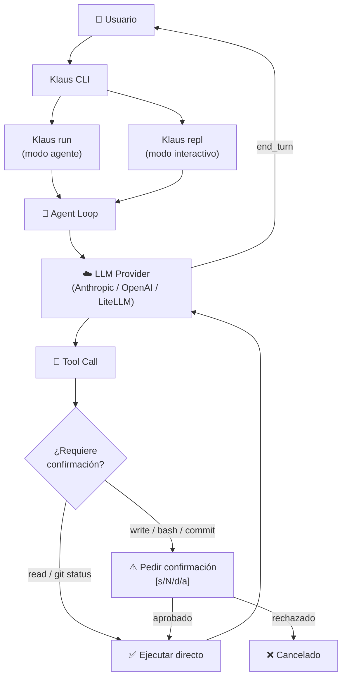

# 💡 Uso

## 🤔 ¿Qué hago? ¿Cómo lo hago? ¿Y para qué lo hago?

**¿Qué hago?** Ejecutar tareas de codificación mediante el agente o mantener una conversación iterativa en el REPL.

**¿Cómo lo hago?** Con los comandos `Klaus run` (una tarea), `Klaus repl` (sesión interactiva), `Klaus sessions` (gestión de historial) y `Klaus config` (configuración).

**¿Para qué lo hago?** Para delegar al agente tareas de refactorización, análisis, generación de tests, commits y cualquier operación sobre el codebase, con control total de las confirmaciones antes de que se ejecute cualquier acción destructiva.

---

## 🗺️ Flujo general



---

## 📟 Comando `Klaus run` — modo agente

Ejecuta una tarea única y sale. Ideal para scripts, CI/CD y tareas puntuales.

```bash
Klaus run <PROMPT> [OPCIONES]
```

### Opciones

| Flag | Tipo | Default | Descripción |
|---|---|---|---|
| `--model`, `-m` | string | config | Override del modelo para esta ejecución |
| `--base-url` | string | config | Override de la URL base del proveedor |
| `--project` | path | cwd | Directorio del proyecto (afecta paths de tools) |
| `--plan` | flag | false | Genera un plan y pide confirmación antes de ejecutar |
| `--allow-writes` | flag | false | Auto-aprueba operaciones de escritura |
| `--allow-bash` | flag | false | Auto-aprueba comandos bash |
| `--yolo` | flag | false | Equivale a `--allow-writes --allow-bash` |
| `--no-stream` | flag | false | Desactiva streaming (output completo al final) |

### Ejemplos

```bash
# Análisis de código (solo lectura — sin confirmaciones)
Klaus run "Explica cómo funciona el módulo sessions.py"

# Tarea de refactorización con plan previo
Klaus run "Extrae la lógica de validación de config.py a un módulo validate.py" --plan

# Generación de tests (requiere escritura)
Klaus run "Añade tests para las funciones de sessions.py" --allow-writes

# Pipeline CI — sin interactividad
Klaus run "Actualiza el CHANGELOG.md con los cambios del último commit" --yolo

# Con modelo específico y URL propia
Klaus run "Resume el fichero README.md" --model claude-opus-4-8 --base-url https://api.anthropic.com
```

---

## 💬 Comando `Klaus repl` — REPL interactivo

Abre una sesión de conversación continua. El historial persiste entre turnos y puede guardarse entre sesiones.

```bash
Klaus repl [OPCIONES]
```

### Opciones

| Flag | Tipo | Default | Descripción |
|---|---|---|---|
| `--model`, `-m` | string | config | Override del modelo |
| `--base-url` | string | config | Override de URL base |
| `--project` | path | cwd | Directorio del proyecto |
| `--session` | string | None | Nombre de sesión (crea o reanuda) |
| `--no-persist` | flag | false | No guardar sesión en disco |
| `--no-stream` | flag | false | Desactiva streaming |
| `--allow-writes` | flag | false | Auto-aprueba escrituras |
| `--allow-bash` | flag | false | Auto-aprueba bash |
| `--yolo` | flag | false | Sin confirmaciones |

### Comandos especiales dentro del REPL

| Comando | Descripción |
|---|---|
| `/help` | Lista todos los comandos disponibles |
| `/clear` | Limpia el historial de la sesión actual (borra mensajes) |
| `/history` | Muestra los mensajes del historial con roles |
| `/sessions` | Lista sesiones guardadas en disco |
| `/tokens` | Muestra tokens de input / output / total acumulados en la sesión |
| `/exit` | Sale del REPL |
| `/quit` | Sale del REPL (alias) |

### Ejemplo de sesión típica

```
$ Klaus repl --session refactor-auth

╭─────────────────────────────────────────────────────────╮
│  🤖 Klaus Code CLI v0.16.0 — REPL interactivo           │
│                                                          │
│  💾 Sesión: refactor-auth                                │
│  ⚡ Streaming: activado                                  │
╰─────────────────────────────────────────────────────────╯

> Lee el fichero auth.py y dime qué mejorarías
[respuesta del agente...]

> Implementa los cambios que propusiste
⚠️  write_file → auth.py
[diff preview]
¿Escribir 'auth.py'? [s/N/d/a]: s

> /tokens
╭──── 📊 Tokens de sesión ────╮
│  Input:  12,450 tokens      │
│  Output: 2,830 tokens       │
│  Total:  15,280 tokens      │
╰─────────────────────────────╯

> /exit
```

---

## 📂 Comando `Klaus sessions` — gestión de sesiones

```bash
Klaus sessions list                    # Lista todas las sesiones guardadas
Klaus sessions show <session_id>       # Muestra el historial de una sesión
Klaus sessions clear <session_id>      # Borra una sesión específica
Klaus sessions clear --all             # Borra todas las sesiones
```

---

## ⚙️ Comando `Klaus config`

```bash
Klaus config show      # Muestra la configuración activa (sin API key)
```

---

## 🔗 Documentación relacionada

- [📦 Installation](installation.md) — cómo instalar y configurar
- [⚙️ Configuration](configuration.md) — referencia completa del config.yaml
- [🔧 Tools](tools.md) — herramientas disponibles para el agente
